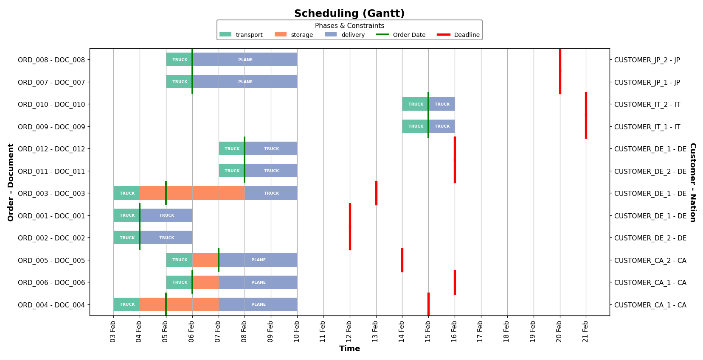
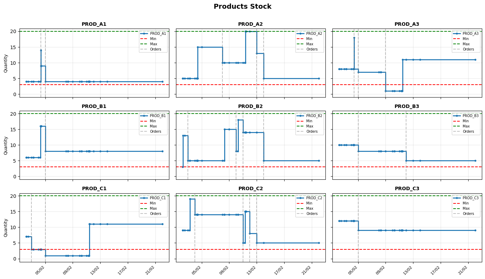

## Descrizione del problema
**Introduzione**
Questo caso d'uso, sviluppato nell'ambito del progetto europeo Horizon SM4RTENANCE, affronta l'ottimizzazione integrata di una Supply Chain composta da un'azienda produttrice e venditrice di diversi codici prodotto, dai clienti che li acquistano e da un fornitore responsabile della produzione. L'obiettivo è migliorare la pianificazione e la gestione dei flussi tra questi attori, ottimizzando tempi, costi ed efficienza complessiva della catena di fornitura.

L'obbiettivo complessivo è fornire uno strumento di pianificazione che permetta di utilizzare un previsionale di ordini di acquisto da parte dei clienti per minimizzare ritardi, costi ed emissioni.

Il previsionale è costituito da un elenco di ordini associati a codice identificativo del cliente, nazionalità, codice prodotto richiesto, quantità, data prevista per l'ordine e deadline per la consegna stabilita secondo le policy aziendali.

Partendo dal vincolo principale del problema, ovvero il soddisfacimento dei termini di consegna al cliente, il flusso di ottimizzazione si sviluppa all'indietro fino alla produzione dei codici prodotto stessi.

Il processo complessivo si divide in tre fasi principali: includendo i processi di consegna, approvvigionamento e produzione,

<ul>
  <li><strong>Delivery</strong>: consegna da parte dell'azienda al cliente.</li>
  <li><strong>Supply</strong>: approvvigionamento dei prodotti dal fornitore all'azienda.</li>
  <li><strong>Production</strong>: produzione interna del fornitore. Si considerano le richieste da parte dell'azienda e altre richieste nello stesso periodo provenienti da altri potenziali clienti del fornitore.</li>
</ul>

<h2>Soluzione</h2>

<strong>Introduzione:</strong> La soluzione è suddivisa in tre step sequenziali integrati, ognuno con modelli specifici che interagiscono tramite output strutturati.

<ul>
  <li><strong>Step 1 — Delivery Optimization:</strong> ottimizza mezzo e timing delle consegne ai clienti da parte dell'azinda per ogni ordine, bilanciando latenze, costi ed emissioni. Utilizza un algoritmo genetico (NSGA-II) per l'ottimizzazione multi-obbiettivo, tenendo conto delle riduzioni di costo e consumo complessivo per spedizioni che aggregano ordini diversi spediti allo stesso paese. Le soluzioni sub-ottimali sono scelte tramite psudo-pesi.</li>
  <li><strong>Step 2 — Supply Optimization:</strong> pianifica anticipo e arrivi fornitori per ridurre numero di trasporti e costi di magazzino interni all'azienda. Anche in questo caso, si impiega un algoritmo genetico per l'ottimizzazione, tenendo conto delle riduzioni di costo per trasporti aggregati.</li>
  <li><strong>Step 3 — Production Simulation &amp; Scheduling:</strong> simula la linea produttiva e la allinea con i valori a stock per evadere ordini nei tempi stabiliti. Il processo produttivo simulato è quello di tre linee produttive parallele, che producono rispettivamente il materiale base ("Plates"), il semilavorato ("Strips") e i codici prodotto finali ("Tapes"). Utilizza una simulazione a eventi discreti (DES) che permette di tenere conto dei vincoli produttivi (es. disponibilità delle macchine, turni di lavoro) e di magazzino (es. quantità minime e capienza per ogni possibile codice prodotto). A differenza dei primi due step, ragiona su una scala temporale oraria, anzi che giornaliera.</li>
</ul>

<strong>Vuoi saperne di più?</strong>

Qui puoi trovare riferimenti alle librerie Python Open Source utilizzate e agli algoritmi implementati:

<ul>
  <li>Ottimizzazione multi-obiettivo: <a href="https://pymoo.org/">pymoo</a>.</li>
  <li>Algoritmo genetico: <a href="https://ieeexplore.ieee.org/document/996017">NSGA-II</a></li>
  <li>Scelta delle soluzioni: <a href="https://pymoo.org/getting_started/part_3.html">Pseudo-Weights</a></li>
  <li>Simulazione a eventi discreti e gestione risorse: <a href="https://simpy.readthedocs.io/en/latest/">SimPy</a></li>
  <li>Strutture dati: <a href="https://pandas.pydata.org/">Pandas</a></li>
  <li>Plotting e visualizzazione: <a href="https://matplotlib.org/">matplotlib</a></li>
</ul>

## Risultati
Il modello sviluppato permette di ottenere degli schedule specifici per le tre fasi della Supply Chain considerate. Ciò si traduce in tabelle contenenti le date di inizio e fine delle spedizioni e dei trasporti associati a ogni ordine e un file JSON contenente i timestamp di inizio produzione per ogni possibile semilavorato e prodotto finale.

Nella figura seguente si può verificare il risultato dell'ottimizzazione per i processi di Delivery e Supply. Si nota come gli ottimizzatori tendano ad accorpare spedizioni relative a clienti della stessa nazione o trasporti vicini nel tempo.

Di seguito invece si riporta l'andamento del livello a magazzino dei diversi codici prodotto, che evidenzia le evasioni relative agli ordini considerati e il rispetto dei vincoli di magazzino.

